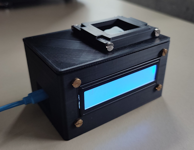
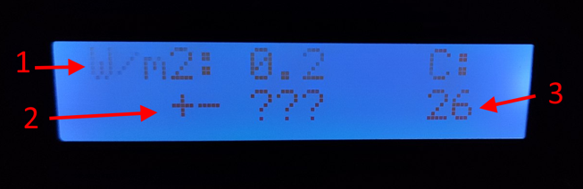

# TSL2591 Arduino Software with Irradiance Calibration

## Hardware
### Main components
- Arduino Pro Micro
- Adafruit TSL2591 Digital Light Sensor
- Adafruit MAX31865 RTD PT100 Amplifier
- LCD 

Powered by an external power source via USB.

### Filter
A neutral density filter foil is incorporated to prevent sensor oversaturation at higher light intensities. The displayed readings take this effect into account.

Filter reflectivity data (measured with PerkinElmer Spectrometer) is available in [`data/filter_reflectivity.csv`](./data/filter_reflectivity.csv).

### Outer casing

The casing was designed and 3D-printed by Stefan Weingand. 

## Files
- `luminosity_sensor.ino` - main software for Arduino
- `requirements.txt` - packages you need to install for running **Python scripts** (ignore if you're only using the Arduino sketch)
- `calibration.py` - script that was used to calculate the coefficients for converting counts to irradiance
- `helpers` - Python scripts that were used for preprocessing calibration data (conversion from serial output to csv and aggregation from csv)

## Interpreting the display data

1 - Irradiance [W/m²]

2 - Estimated error range [W/m²]. If the irradiance is below a certain threshold (about 10% AM1.5G), the error cannot be reliably estimated and will show “???”.

3 - Temperature [C]

## Serial monitor control
The device outputs readings to the serial monitor and accepts the following commands:
- `log` - print measurements for 10 seconds, then stop
- `log <sec>` - continuously print measurements every <sec> seconds

## Counts to irradiance conversion
The TSL2591 sensor's raw counts are converted to irradiance (W/m²) using a power law relationship[^1]:

$$\text{Irradiance} = A \times (\text{Counts})^B$$

where $A$ and $B$ are empirically determined coefficients. 

For this implementation, coefficients were derived using `scipy.optimize.curve_fit` to fit the sensor's raw counts measured under a solar simulator (Wavelabs Sinus-70) to expected AM1.5G spectrum irradiance values[^2]. The device is calibrated to AM1.5G intensities between 10-120%.

Limitations: 
- Higher temperatures can result in reading higher counts from the sensor, with an error margin of about 5% (in counts). This is represented by the error estimation provided on the screen. 
- Measuring the irradiance of different spectra, such as AM0, or AM1.5G of intensity below 10% or above 120%, might produce less reliable results.

[^1]: Feng, Y. and Wang, J., 2020. Design and development of a low-cost glazing measurement system. *MethodsX, 7*, p.101028.

[^2]: PV Lighthouse (n.d.) Spectrum Library. Available at: https://www2.pvlighthouse.com.au/resources/optics/spectrum%20library/spectrum%20library.aspx (Accessed: 2025-02-26).
